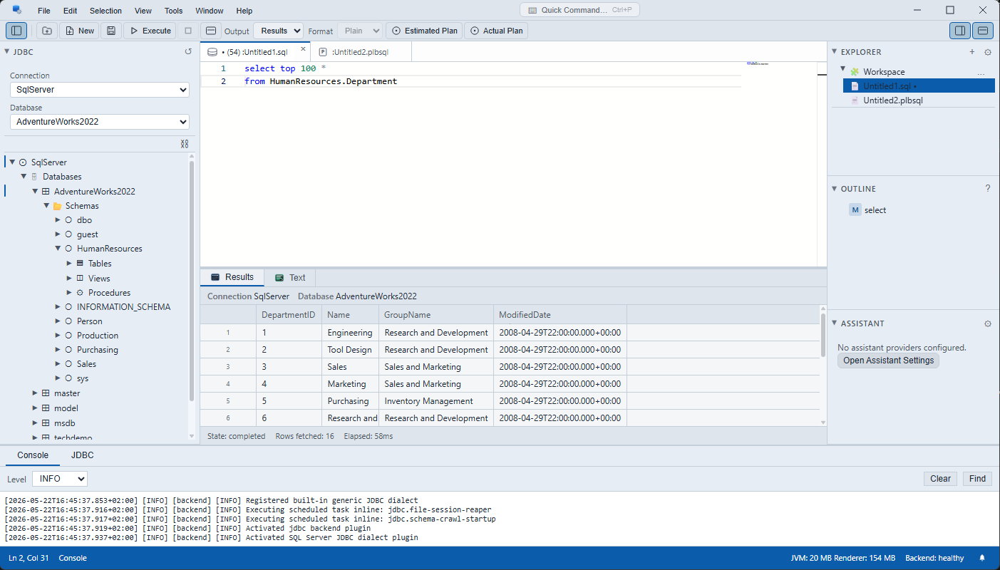
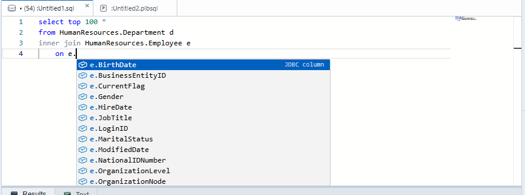
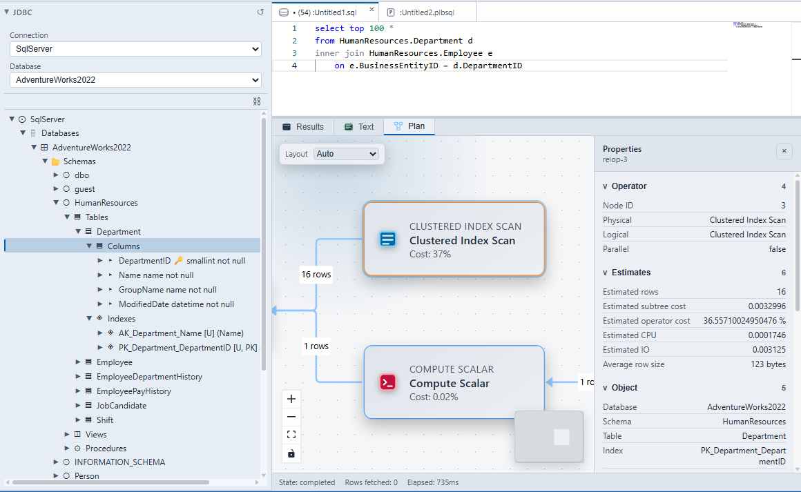
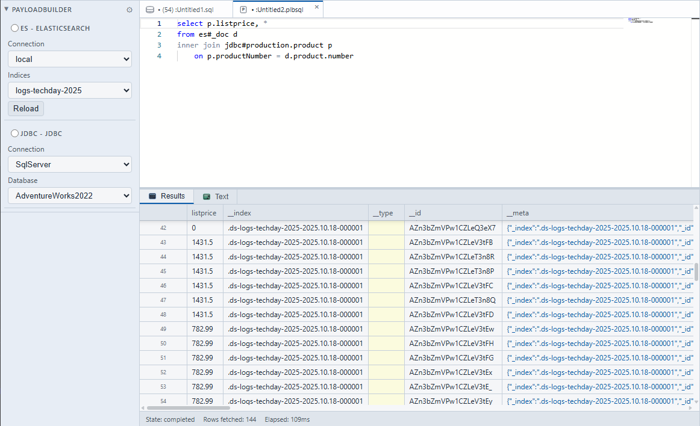
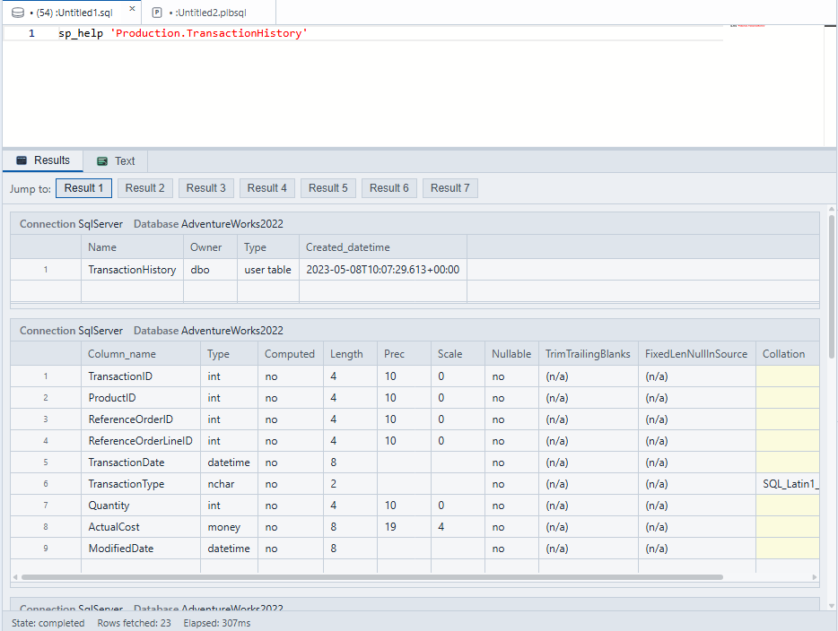
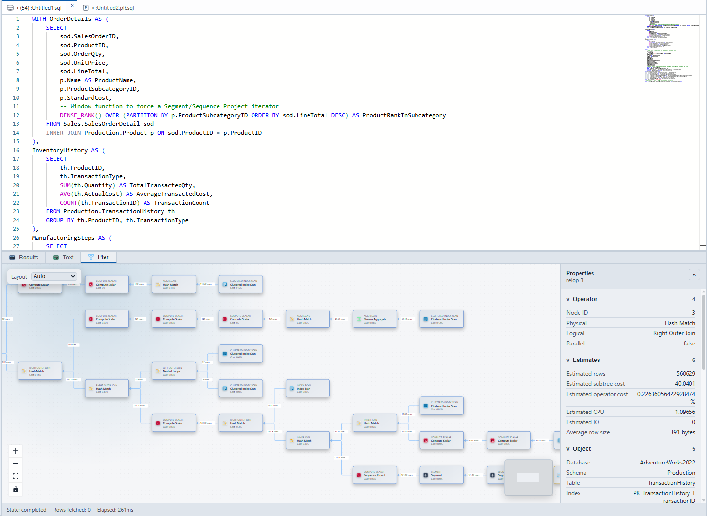

# Queryeer

[](https://github.com/kuseman/queryeer-desktop/actions/workflows/queryeer-desktop-ci.yml)
[](https://opensource.org/licenses/MIT)

**Queryeer** is a modern, cross-platform desktop query tool that lets you explore, query, and visualize data across multiple database engines — all from one unified interface.

> Queryeer is currently in active development. Expect breaking changes and frequent iteration.

---

## Hero

> 

---

## Key Features

###  Multi-Engine Query Editor
Write and execute queries in **SQL** and **Payloadbuilder** — a powerful cross-source query language — all with Monaco Editor-powered syntax highlighting, auto-completion, and hover information.

> 

###  Connect to Any Database
Built-in **JDBC support** for SQL Server, PostgreSQL, MySQL, H2, and generic JDBC connections. Manage connections, browse database schemas (tables, columns, indexes, procedures), and execute queries with dialect-aware features.

- SQL Server dialect with ShowPlan XML-to-graph conversion
- Windows Integrated Authentication support
- Connection health monitoring and schema caching

> 

###  Cross-Source Queries with Payloadbuilder
Query across **JDBC databases, Elasticsearch indices, HTTP APIs, and filesystem files** — all within a single query. Payloadbuilder catalogs let you configure and combine disparate data sources seamlessly.

> 

### ⚡ High-Performance Results Grid
Results are displayed in a blazing-fast data grid ([Glide Data Grid](https://glideapps.github.io/glide-data-grid/)) supporting large result sets, copy-to-clipboard, and extensible cell actions.

> 

###  Query Plan Visualization
Visualize query execution plans as interactive graphs. SQL Server ShowPlans are automatically converted to flow diagrams using React Flow.

> 

###  VS Code-Inspired Interface
A familiar, extensible shell layout with:
- Resizable sidebars, bottom panels, and editor area
- Multi-tab editor pane
- Configurable toolbar and status bar
- Persistent workspace layout across sessions

###  AI Assistant
Built-in AI assistant that can help with query writing, schema exploration, and more. Configurable provider, model, and API endpoint.

###  Encrypted Security Vault
Sensitive credentials (passwords, tokens, API keys) are stored in an **AES-GCM encrypted vault** locked behind a master password. Optional OS secure storage for the master password.

###  Customizable Themes
Choose from built-in themes, load custom `.json` theme files, or visually customize your own theme with the built-in theme studio.

###  Extensible Plugin System
Queryeer is built on a modular plugin architecture. Both the frontend (TypeScript) and backend (Java) support plugins, allowing the tool to be extended with new engines, output formats, dialects, data sources, and UI contributions.

###  Cross-Platform
Runs on **Windows**, **macOS**, and **Linux**.

> **macOS users:** unsigned development builds need a one-time Gatekeeper bypass — see [MACOS.md](MACOS.md).

---

## Quick Start

### Prerequisites
- [Node.js](https://nodejs.org/) 20+
- A Java 25 compatible JDK on `PATH`

### Install & Run

```bash
git clone https://github.com/kuseman/queryeer-desktop.git
cd queryeer-desktop
npm install
npm run dev
```

> **For developers** looking to build plugins, contribute code, or understand the architecture, see the **[DEVELOPMENT.md](DEVELOPMENT.md)** guide.

---

## Documentation

- [Architecture Decision Records](queryeer-desktop/documentation/)
- [Backend Protocol Specification](queryeer-desktop/documentation/BACKEND_PROTOCOL.md)
- [Security & Vault Guide](queryeer-desktop/documentation/SECURITY_README.md)
- [macOS Gatekeeper Guide](MACOS.md) — bypass unsigned app blocking

---

## License

[MIT](LICENSE)
